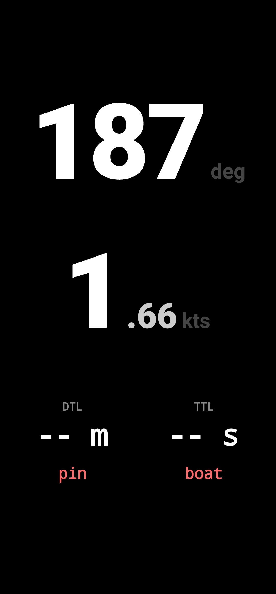
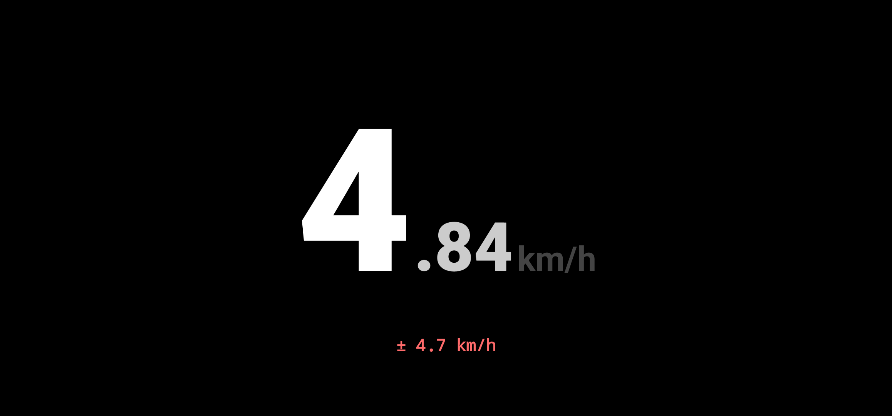

# GPS Speedometer

A high-contrast, privacy-first Android speedometer and sailing start-line dashboard. It has no ads, analytics, accounts, or internet permission.

[Download the latest APK](https://github.com/mightykatun/speedometer/releases/latest) or build it from source.

## Preview

<p align="center">
  
  
</p>

## Features

- Accuracy-aware GNSS speed in km/h, mph, knots, or m/s
- Optional bounded IMU prediction for a rigidly mounted phone
- Normal, focused-speed, and regatta portrait displays
- True vessel heading with offline WMM2025 magnetic correction
- Signed distance and strict time to a captured sailing start line
- Live speed trend, session maxima, and an offline position trail
- Explicit GPX export to Downloads on Android 10+
- Picture-in-Picture and configurable UI refresh intervals

Double-tap the speed to cycle portrait displays. Landscape and Picture-in-Picture always use the enlarged speed-only display. In regatta mode, tap `pin` or `boat` to capture that endpoint and double-tap it to clear it.

## Privacy

Location and sensor data stay in memory unless you explicitly export a GPX file. The app stops GPS and sensor listeners when it leaves the foreground. Session maxima and trail segments remain until reset or process death; regatta points remain until individually cleared or process death.

## Build

Requires Java 21 and the Android SDK:

```bash
./gradlew testDebugUnitTest lintDebug assembleDebug
```

Install the debug APK on a connected device with `make install`. The minimum Android version is 7.0 (API 24); the target SDK is 35.

See [WIKI.md](WIKI.md) for estimator, heading, regatta, lifecycle, and validation details. See [RELEASING.md](RELEASING.md) for the production release process.

## License

MIT
